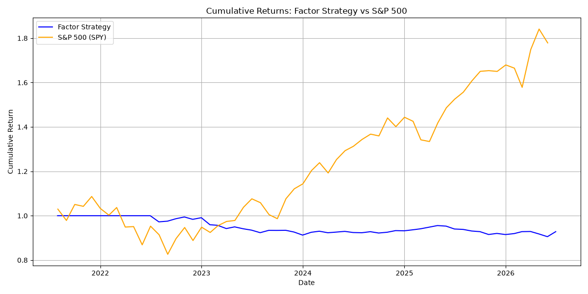

# Multi-Factor Equity Model

A multi-factor equity model that scores S&P 100 stocks on momentum, volatility, and value factors, constructs a long-short portfolio, and backtests performance against the S&P 500.

## Project Structure
- `src/data_loader.py` — downloads 5 years of daily price data for S&P 100 stocks via yfinance
- `src/factors.py` — computes momentum (12-1), annualized volatility, and value (inverse P/E) factors
- `src/portfolio.py` — z-scores and combines factors into a composite signal, assigns long/short positions
- `src/backtest.py` — simulates monthly rebalancing and computes portfolio returns
- `src/performance.py` — calculates Sharpe ratio, max drawdown, and plots cumulative returns

## Factors
- **Momentum**: 12-month return skipping the most recent month (12-1 momentum) to avoid short-term reversal
- **Volatility**: Trailing 252-day annualized realized volatility — low volatility stocks score higher
- **Value**: Inverse trailing P/E ratio — cheaper stocks score higher

## Results
- **Sharpe Ratio**: -0.915
- **Max Drawdown**: -16.2%

## Limitations
- **Limitation 1**: Survivorship bias. We used today's S&P 100 list, which only contains companies that are large and successful right now. Companies that were in the index 5 years ago but later got dropped (due to poor performance, bankruptcy, mergers) are excluded. This makes our universe look better than it actually was historically.
- **Limitation 2**: Look-ahead bias in the value factor. We used today's P/E ratio for all 60 months of backtest history. In reality, we couldn't have known 2021's P/E ratio in 2021 using 2026 data. This contaminates the backtest with future information.
- **Limitation 3**: No transaction costs. Every month we rebalance — buying and selling stocks. In reality, this costs money (bid-ask spreads, commissions). We modeled zero costs.
- **Limitation 4**: SMB factor limited by universe. The SMB (Small Minus Big) size factor is designed for broad market universes with real size dispersion. Applied to the S&P 100 (exclusively large-cap stocks), all stocks score similarly on SMB, reducing its predictive power. A full NYSE/NASDAQ universe would better capture this factor.

## Tech Stack
- Python, pandas, numpy, yfinance, matplotlib
- Modular pipeline: separate modules for data, factors, portfolio, backtest, performance